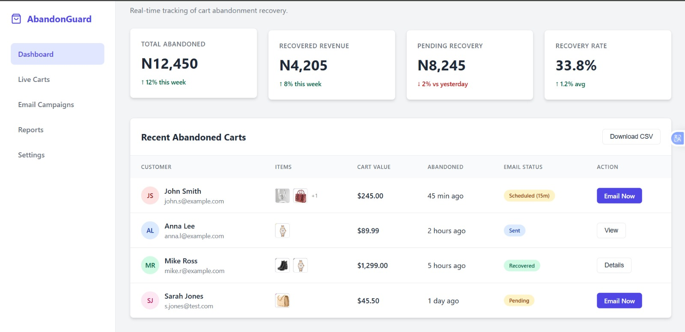
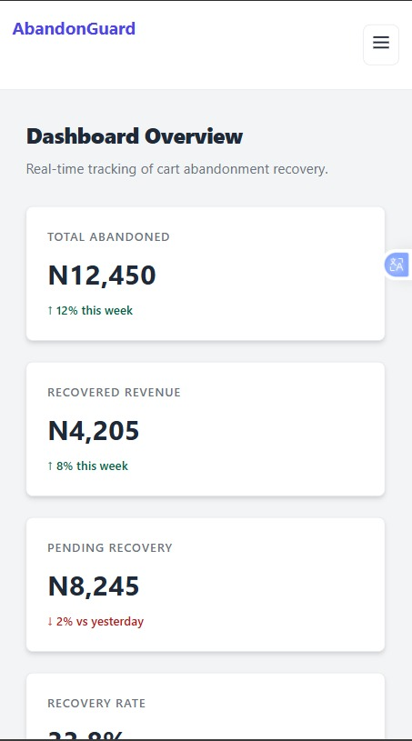
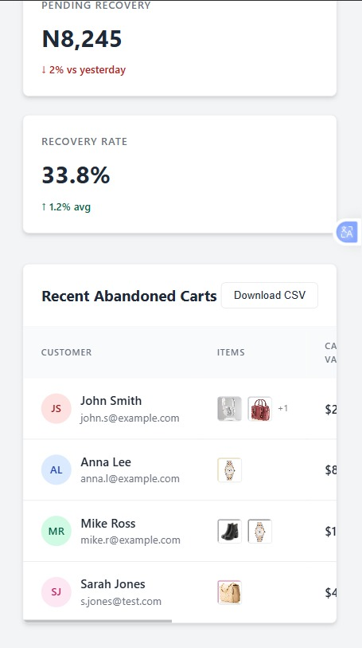

# Abandon Guard

## Overview
Abandon Guard is a high-fidelity, single-page UI prototype of an e-commerce analytics dashboard. Built as a core project during my Dev & Design Bootcamp, this dashboard focuses on the visual representation of real-time cart abandonment data. It demonstrates a "clean and crisp" approach to data visualization using pure frontend structure.

## Problem It Solves
Many store owners struggle to visualize the scale of their lost revenue. Abandon Guard provides a conceptual solution by:
- Mapping out how complex data (emails, cart values, drop-off points) should be organized for maximum readability.
- Creating a blueprint for a recovery system that prioritizes user experience for the store administrator.
  
## Features
- Dashboard Layout: A structured, multi-component interface featuring a sidebar, header, and main content area.
- Metric Cards: Visual blocks highlighting key performance indicators (KPIs) like total revenue lost and recovery rates.
- Data Feed UI: A mock real-time list of abandoned carts, demonstrating how customer information should be presented.
- Analytical Visuals: CSS-driven layouts that simulate progress tracking.
- Fully Responsive: Optimized for a seamless experience across desktop and mobile screens.

## Preview

## Problems I Solved
- Complex Grid Management: One of the biggest challenges was organizing the various dashboard widgets (charts, lists, and cards) using CSS Grid. I ensured that each element aligned perfectly to maintain a professional, balanced aesthetic.
- CSS Component Architecture: To keep the code manageable in a single-page format, I focused on writing reusable CSS classes, ensuring that margins, padding, and colors remained consistent throughout the project.
- Visual Hierarchy: I solved the problem of "information overload" by using font weights and color contrasts to guide the user's eye toward the most important metrics first.

## Technologies Used
- HTML
- CSS

## How to Use
- Download/Clone: Download the repository to your local machine.
- Open the project folder
- Launch: Double-click the index.html file to view it in your preferred web browser

## Future Improvements
- Add local storage to save tasks
- JavaScript Integration: Addingfunctiona lity to make the charts interactive and the data feed filterable.
- Backend Connection: Integrating a database to pull actual live abandonment data from an e-commerce API.
- Dark Mode Toggle: Implementing a theme switcher to allow users to toggle between the current "clean" look and a dark mode version.
- Improve UI design and animations

## Lessons Learned
- The Power of Pure CSS: Building this taught me the depth of CSS Grid and the importance of understanding the "box model" in detail.
- Design Thinking: This project reinforced that good software is about how information is structured to be useful to a human being.
- I learned the importance of responsive design
